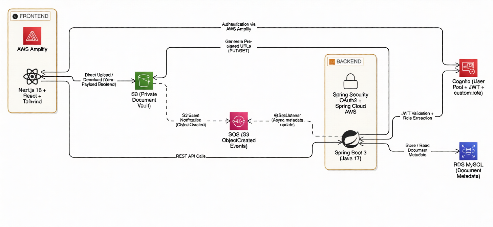

# DocuGuard: Role-Based Secure Document Vault

DocuGuard is a full-stack, cloud-native enterprise application designed for secure, role-based document management. It leverages advanced AWS services, zero-trust architecture principles, and event-driven processing to ensure that sensitive files are stored, accessed, and managed with the highest level of security.

This project serves as a comprehensive demonstration of deep IAM integration, OAuth2 workflows, secure cloud storage patterns (like S3 Pre-signed URLs), and asynchronous backend processing.

---

## 🏗️ Architecture Overview

DocuGuard is built using a decoupled architecture, separating the client interface from the API and utilizing managed AWS services for heavy lifting (auth, storage, messaging).



### 1. Frontend (Next.js & React)
- **Framework:** Next.js (App Router), React, Tailwind CSS.
- **Authentication:** AWS Amplify (`amazon-cognito-identity-js`) is used to handle user sign-up, sign-in, and password changes directly with AWS Cognito.
- **UI/UX:** A professional, responsive enterprise dashboard featuring data tables for document management.

### 2. Backend (Spring Boot 3)
- **Framework:** Java 17, Spring Boot 3.3.0.
- **Security:** Spring Security with OAuth2 Resource Server. It intercepts every API request, validates the Cognito JWT signature, and extracts the user's role.
- **Data Persistence:** Spring Data JPA connected to an Amazon RDS (MySQL) instance for tracking document metadata.

### 3. Cloud Infrastructure (AWS)
DocuGuard heavily relies on the AWS ecosystem for security and scalability:

*   **Amazon Cognito (Identity Provider):** Handles all user authentication. It issues JWT tokens containing a custom `custom:role` attribute (either `ADMIN` or `USER`) which dictates access permissions across the app.
*   **Amazon S3 (Secure Storage):** The document vault. **The bucket is completely private.** Files are never served publicly. The backend generates temporary, time-bound **Pre-Signed URLs** that the frontend uses to securely upload and download files directly to/from AWS.
*   **Amazon SQS (Event-Driven Logging):** When a file is uploaded to S3, S3 automatically publishes an `ObjectCreated` event. An SQS queue catches this event, and the Spring Boot backend asynchronously polls the queue using `@SqsListener` to update the RDS database with the new document metadata.
*   **Amazon EC2 & RDS:** The application is built to be deployed on an EC2 instance, connected to a highly available RDS MySQL database.

---

## 🚀 Key Features & Implementation Highlights

### Role-Based Access Control (RBAC)
Every user is assigned a role (`ADMIN` or `USER`) stored securely in Cognito. 
*   **Admins** have access to all documents and possess the exclusive ability to upload new files and assign required access levels.
*   **Users** can only view and download documents tagged with the `USER` access level.
*   The backend validates the Cognito JWT on every request before generating any S3 Pre-Signed URLs.

### Zero-Payload Backend (Pre-Signed URLs)
To ensure high performance and low bandwidth costs on the backend server, the Spring Boot application **never touches the file bytes**.
*   **Uploads:** Admins request a `PUT` Pre-Signed URL from the backend, then the browser uploads the file directly to S3.
*   **Downloads:** Users request a `GET` Pre-Signed URL. If authorized by Spring Security, the backend provides a temporary link for the browser to download the file directly from AWS.

### Event-Driven Metadata Extraction
Instead of blocking the user's upload request while the backend updates the database, DocuGuard uses an asynchronous, eventually-consistent model:
1. File hits S3.
2. S3 sends an event to SQS.
3. Spring Boot's `@SqsListener` picks up the message, extracts the filename and role tags from the S3 object key, and saves the new record to the MySQL database.

### Embedded Admin Portal
The frontend features a dedicated portal for Administrators to programmatically create new users via the `CognitoIdentityProviderClient` in the backend AWS SDK. AWS automatically emails the new users their temporary credentials.

---

## 🛠️ Tech Stack

**Frontend:**
*   Next.js 16
*   React 19
*   Tailwind CSS
*   AWS Amplify (Auth tracking)

**Backend:**
*   Java 17
*   Spring Boot 3.3.0
*   Spring Security (OAuth2 / JWT)
*   Spring Cloud AWS (S3, SQS)
*   Spring Data JPA (Hibernate)

**AWS Services Configured:**
*   IAM (Roles & Policies)
*   Cognito (User Pools)
*   S3 (Private Storage & Events)
*   SQS (Standard Queues)
*   RDS (MySQL)
*   EC2 (Amazon Linux 2023)

---

## ⚙️ Local Development Setup

### 1. AWS Prerequisites
To run this locally, you must have an AWS Account with the following provisioned:
- An IAM User with programmatic access keys.
- A Cognito User Pool with a `custom:role` attribute.
- A private S3 Bucket configured with a CORS policy allowing local `PUT`/`GET`.
- An SQS Queue subscribed to the S3 bucket's "Object Created" events.

### 2. Backend Setup
1. Navigate to the `backend/` directory.
2. Update `src/main/resources/application.properties` with your AWS credentials, Cognito details, and Database connection string.
3. Run the server:
   ```bash
   ./gradlew bootRun
   ```

### 3. Frontend Setup
1. Navigate to the `frontend/` directory.
2. Create a `.env.local` file:
   ```env
   NEXT_PUBLIC_API_URL=http://localhost:8080
   NEXT_PUBLIC_COGNITO_USER_POOL_ID=<your-pool-id>
   NEXT_PUBLIC_COGNITO_CLIENT_ID=<your-client-id>
   ```
3. Install dependencies and run:
   ```bash
   npm install
   npm run dev
   ```

